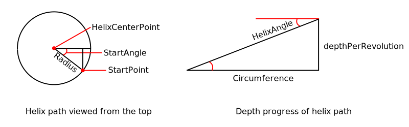
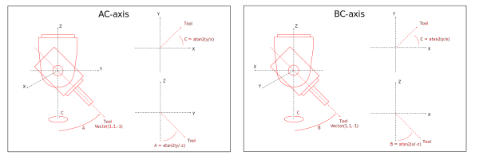

The following describes a construction technique that uses timber beams and basic joinery techniques (e.g. mortise and tenon) to build complex structures. The design starts from a mesh of interconnected lines that serves as the basis for both the beams and the joinery features used to connect them. Machining instructions are then generated based on the features of each beam. Development is done in [FreeCAD][freecad], an open-source CAD/CAM package that offers a Python interface for scripting. A Python console (available under **View | Panels | Python Console**) offers direct interaction with the application. Code is stored in the FreeCAD `Macro` directory, the location of which can be found under `FreeCAD | Preferences | General | Macro`.

# FREECAD

The FreeCAD application itself provides core functionality like interaction with documents, display of document structure in the tree view, visualization of objects in the 3D view window... The application builds upon a number of key libraries to provide this functionality:

* [OpenCascade][opencascade]: geometric modelling
* [Coin3D][coin3d]: visualization of 3D graphics, provides the same API as [Open Inventor][openinventor] and also builds on OpenGL
* [QT][qt]: design of the user interface

Source code for FreeCAD consists in a mix of C++ and Python, with most of the functionality written in C++ also made available to Python scripts. This is also the case for above libraries:

* [Pivy][pivy]: wrapper for Coin3D, offers interaction with the 3D View window
* [PySide][pyside]: wrapper for QT, offers interaction with the FreeCAD user interface

A significant portion of FreeCAD functionality comes in the form of modules. The `Part` module for example interfaces with the OpenCascade geometric modelling kernel, while the `Path` module provides functionality for generating the GCode toolpaths that run on a CNC machine.

# BEAM

At creation a `Beam` object is passed a reference to a line in the mesh. It is modelled according to the length of this line and its relationship to adjoining lines. A `test` function creates an example `Beam` object.

```python
from Truss import Beam
Beam.test()
import importlib
importlib.reload(Beam)
Beam.test()
```

## FREECAD OBJECTS

The basic FreeCAD application is mainly concerned with opening documents, saving them, and displaying their content. Other functionality is contained in so-called workbenches. The `Part` workbench for example takes care of modelling solid geometry, while the goal of the `Path` workbench is to generate GCode for running on a CNC machine. Each workbench saves its `objects` in the document. These objects are data containers, of which multiple types are available, and attributes can be saved on each object and also stored in the document. Attributes can for example be the length and width of a shape, the radius of a corner, a vector determining the orientation of a shape, etc. Objects are stored in a standard format document (.FCStd), which in fact is nothing more than a ZIP archive that can be extracted for a closer look at its content. It contains, amongst others, an `Document.xml` file describing the objects in the document, and a `GuiDocument.xml` file detailing how objects are displayed in the tree view and 3D window of FreeCAD's graphical user interface (for example specifying line color and thickness). 

The following command gives an overview of the object types supported by a document. Additional modules might first need to be loaded for the object types they add to become available:

```python
import Part
import Mesh
doc = FreeCAD.newDocument()
doc.supportedTypes()
```

## OBJECT BASED ON A PYTHON SCRIPT

In interesting capability of FreeCAD is that it allows for creating objects according to your custom Python script. The latter can take care of adding properties to the object, generating shapes, providing functionality for making changes to those shapes, and more. in fact anything that can be done in Python and with the Python libraries available on the system. 

```python
import FreeCAD
doc = FreeCAD.newDocument()
beam = doc.addObject("Part::FeaturePython", "Beam")
beam.addProperty("App::PropertyLength", "Length").Length = 1000.0
```

Should you unzip the FreeCAD document and open the `Document.xml` file it contains, above commands should have created something like the following XML-structured description::

```xml
<Document SchemaVersion="4">
   <Objects Count="1">
      <Object type="Part::FeaturePython" name="Beam" />
   </Objects>
   <ObjectData Count="1">
      <Object name="Beam">
         <Properties Count="1">            
            <Property name="Length" type="App::PropertyLength">               
                <Float value="1000"/>
            </Property>
         </Properties>
      </Object>
   </ObjectData>
</Document>
```

The Python script itself is not stored in the FreeCAD document, but the module and name of the relevant Python class is added to the object's `Proxy` attribute. When the document is opened, FreeCAD expects to find this class in the Python search path and takes care of instantiation, after which it is assigned to the `Proxy` attribute on the object so it can be accessed.

## BASIC BEAM MODEL

Creating a parametric beam shape using a Python script isn't very difficult. Each beam has a couple of basic properties being length, width and height, which are created on the object and will thus be stored in the document. The `Part` workbench comes with a `makeBox` function that can be used to create the beam shape. The `FeaturePython` object is passed as an argument when instantiating a beam object. This allows setting properties directly on the object and assigning the class instance itself to the `Proxy` attribute. If a property of the object is modified, FreeCAD reacts by running the `execute` method on the object's `Proxy` attribute.

``` Beam.py
import Part

class beam():
    def __init__(self, obj):
        obj.Proxy = self

        obj.addProperty('App::PropertyLength', 'Length', 'Dimensions', 'Box length').Length = '100 cm'
        obj.addProperty('App::PropertyLength', 'Width', 'Dimensions', 'Box width').Width = '10 cm'
        obj.addProperty('App::PropertyLength', 'Height', 'Dimensions', 'Box height').Height = '10 cm'

    def execute(self, obj):
        """
        Called on document recompute
        """

        beam = Part.makeBox(obj.Length, obj.Width, obj.Height)
        obj.Shape = beam
```

Previous class can be assigned to a `FeaturePython` object, but something is still lacking to display the resulting shape on screen. Rendering on screen requires a separate object, a so-called `ViewProvider`, which attaches to the `ViewObject` attribute of our `FeaturePython` object. The following piece of code is a very basic implementation and does nothing more than assign itself to the ViewObject's Proxy attribute. Many more predefined methods are available to implement different kinds of behaviour. 

``` BeamGui.py
class ViewProvider():

    def __init__(self, obj):
        """
        Set this object to the proxy object of the actual view provider
        """
        obj.Proxy = self

    def attach(self, obj):
        """
        Setup the scene sub-graph of the view provider, this method is mandatory
        """
        return
```

It takes a couple of steps to add a beam to a document: first check if there is an active document and create one if there isn't, add a `Part::FeaturePython` object to this document, assign the Python script to the latter, recompute the document for changes to take effect, and add a ViewProvider to the object in order to show the shape on screen. Before assigning to the `ViewObject` you'll need to make sure the FreeCAD Gui is actually up, otherwise the ViewObject attribute will not be available. Below convenience function takes care of these steps:

``` Beam.py
import FreeCAD
from Truss import BeamGui

def test(obj_name):
    doc = FreeCAD.ActiveDocument
    if not doc:
        doc = FreeCAD.newDocument()
    obj = doc.addObject("Part::FeaturePython", obj_name)
    beam(obj)
    doc.recompute()
    if FreeCAd.GuiUp:
        BeamGui.ViewProvider(obj.ViewObject)
    return obj
```

# JOINTS

Machining needs to be done before beams can be joined together. The locations, orientations and other properties of joints are calculated from the geometry of the line it references in the mesh. Each beam has its own `uvw` coordinate system which is used to position and orient joints. Therefore the location of the beam can be changed without affecting the relative position of its joints. The mortise and tenon joint is very common in woodworking and will be described next.

## MORTISE AND TENON JOINT

This type of joint consists in a mortise (hole), a tenon (tongue), and optionally a hole for a dowel to secure the assembly. All features of the mortise and tenon joint are modelled in a single Python class named `Mortise` for brevity. A `Type` attribute specifies if the object generates a mortise, a tenon, or a dowel. For removing material around the tenon the extent of stock dimensions needs to be known, something that is not necessary for creating the mortise. Each mortise has length, width and depth, while stock material has width and height parameters.

Features are modelled at the origin and in a default (temporary) orientation, after which they are moved and rotated to their proper position. The latter is determined by a `position`, a `normal` and a `direction` vector. The reason for modelling features at the origin is that the default `PathAdative` operation expects them to be oriented along the positive Z-axis, so its easier to just generate the path there and move it afterwards. Moving is done using the object's `Placement` matrix. The mortise hole is cut out of the stock, and the resulting shape used to cut tenon tongues at the ends of the beam. The tenon tongue shape is used to cut mortise holes in the sides of the beam, and the dowel hole still needs to be implemented. An `OperationExists` property is used to keep track of whether the adaptive milling operation already exists. Because the milling operation links to properties of the mortise object, it is automatically recalculated when any of these properties are modified. 

``` Mortise.py
class Mortise():
    """ Create a mortise and tenon joint"""
    def __init__(self, obj):

        obj.Proxy = self

        obj.addProperty('App::PropertyString', 'Description', 'Base', 'Joint description').Description = "Mortise and tenon joint"
        obj.addProperty('App::PropertyEnumeration', 'Type', 'Base', 'Joint type').Type = ["mortise","tenon"]
        obj.Type = "mortise"

        obj.addProperty('App::PropertyLength', 'StockWidth', 'Dimensions', 'Stock width').StockWidth = '102 mm'
        obj.addProperty('App::PropertyLength', 'StockHeight', 'Dimensions', 'Stock length').StockHeight = '102 mm'
        obj.addProperty('App::PropertyLength', 'MortiseWidth', 'Dimensions', 'Mortise width').MortiseWidth = '30 mm'
        obj.addProperty('App::PropertyLength', 'MortiseLength', 'Dimensions', 'Mortise length').MortiseLength = '60 mm'
        obj.addProperty('App::PropertyLength', 'MortiseDepth', 'Dimensions', 'Mortise depth').MortiseDepth = '60 mm'

        obj.addProperty('Part::PropertyPartShape', 'StockFace', 'Faces', 'Face defining stock')
        obj.addProperty('Part::PropertyPartShape', 'MortiseFace', 'Faces', 'Face defining feature')

        obj.addProperty('App::PropertyVector', 'TemporaryPosition', 'Orientation', 'Temporary mortise position').TemporaryPosition = FreeCAD.Vector(0,0,0)
        obj.addProperty('App::PropertyVector', 'TemporaryNormal', 'Orientation', 'Temporary mortise normal').TemporaryNormal = FreeCAD.Vector(0,0,1)
        obj.addProperty('App::PropertyVector', 'TemporaryDirection', 'Orientation', 'Temporary mortise direction').TemporaryDirection = FreeCAD.Vector(0,1,0)

        obj.addProperty('App::PropertyVector', 'Position', 'Orientation', 'Mortise position').Position = FreeCAD.Vector(0,0,0)
        obj.addProperty('App::PropertyVector', 'Normal', 'Orientation', 'Mortise normal').Normal = FreeCAD.Vector(0,0,1)
        obj.addProperty('App::PropertyVector', 'Direction', 'Orientation', 'Mortise direction').Direction = FreeCAD.Vector(0,1,0)

        obj.addProperty('App::PropertyBool', 'OperationExists', 'Operations', 'Linked adaptive milling operation exists').OperationExists = False

        self.execute(obj)
```

Next method creates a face at the origin and in the XY-plane that represents a section of the beam stock. It is used in the `PathAdaptive` operation and to cut the tenon feature.

```
def getStockFace(self, obj):
    "Return temporary shape created at the origin and in a default orientation"

    height = obj.StockHeight.Value
    width = obj.StockWidth.Value

    centerPoint = FreeCAD.Vector(-height/2, -width/2, 0)
    stockFace = Part.makePlane(height, width, centerPoint)

    return stockFace
```

Similarly a face for the mortise is created at the origin and in the XY-plane. This face is also used as an input for the `PathAdaptive` operation, and to create the shape that cuts a mortise in the beam.

```
def getMortiseFace(self, obj):
    "Return face of a mortise, modelled at the origin and in a default orientation"

    length = obj.MortiseLength.Value
    width = obj.MortiseWidth.Value

    ## Points in each quadrant
    point0 = FreeCAD.Vector(+width/2, +length/2-width/2, 0)
    point1 = FreeCAD.Vector(-width/2, +length/2-width/2, 0)
    point2 = FreeCAD.Vector(-width/2, -length/2+width/2, 0)
    point3 = FreeCAD.Vector(+width/2, -length/2+width/2, 0)

    line03 = Part.makeLine(point3,point0)
    line21 = Part.makeLine(point1,point2)

    ## Arcs
    ### Midpoints
    point10 = FreeCAD.Vector(0, +length/2, 0)
    point32 = FreeCAD.Vector(0, -length/2, 0)

    arc10 = Part.Edge(Part.Arc(point1,point10,point0))
    arc32 = Part.Edge(Part.Arc(point3,point32,point2))

    ## Face and Shape
    mortiseWire = Part.Wire([line03,arc32,line21,arc10])
    mortiseFace = Part.Face(mortiseWire)

    return mortiseFace
```

The `Mortise` object's `execute` method takes care of generating the required shapes, cutting mortise out of stock, and assigning the appropriate shape to the object's `Shape` property depending on whether it represents a mortise or a tenon. The object's `Placement` attribute puts the shape in the proper position and orientation. The last call adds an adaptive milling operation for the relevant feature, it will be discussed in the next section.

```python
def execute(self, obj):
    "Executed on document recomputes"

    obj.StockFace = self.getStockFace(obj)
    obj.MortiseFace = self.getMortiseFace(obj)
    stockShape = obj.StockFace.extrude(-obj.MortiseDepth.Value * obj.TemporaryNormal)
    mortiseShape = obj.MortiseFace.extrude(-obj.MortiseDepth.Value * obj.TemporaryNormal)
    cutoutShape = stockShape.cut(mortiseShape)

    if obj.Type == "mortise":
        obj.Shape = mortiseShape
    else:
        obj.Shape = cutoutShape

    # Placement
    obj.Placement.Base = obj.Position
    rotation1 = FreeCAD.Rotation(obj.TemporaryNormal, obj.Normal)
    rotation2 = FreeCAD.Rotation(obj.TemporaryDirection, obj.Direction)
    obj.Placement.Rotation = rotation1.multiply(rotation2)

    # Create adaptive milling operation
    if not obj.OperationExists:
        self.addOperation(obj)
        obj.OperationExists = True
```

A separate method takes care of adding a couple of mortises to a FreeCAD document and is used for testing. By having a `test` method in the same script one can simply make changes, import the script again with `importlib.reload` and create features using the test method. Reloading a script only fetches the latest version of the script and not of its dependencies, so reloading a separate test script would not automatically reload the script being tested. After checking for an active document, below `test` method creates a list of tuples, each tuple containing properties defining a feature. `Mortise` objects are then created for each feature and added to the document, after which they are fused and returned. 

``` Mortise.py
def test():
    """ Add some mortises to a document, for testing """

    document = FreeCAD.ActiveDocument
    if not document:
        document = FreeCAD.newDocument()

    # create some features for testing
    features = []

    position = FreeCAD.Vector(0,50,50)
    normal = FreeCAD.Vector(-1,0,0)
    direction = FreeCAD.Vector(0,1,0)
    type = "tongue"
    features.append((position, normal, direction, type))

    position = FreeCAD.Vector(200,0,50)
    normal = FreeCAD.Vector(0,-1,0)
    direction = FreeCAD.Vector(1,0,0)
    type = "hole"
    features.append((position, normal, direction, type))

    position = FreeCAD.Vector(1000,50,50)
    normal = FreeCAD.Vector(1,0,0)
    direction = FreeCAD.Vector(0,1,0)
    type = "tongue"
    features.append((position, normal, direction, type))

    objects = []
    for (position, normal, direction, type) in features:
        objectMortise = document.addObject("Part::FeaturePython", "Mortise")
        Mortise(objectMortise)
        MortiseGui.ViewProviderBox(objectMortise.ViewObject)
        objectMortise.Position = position
        objectMortise.Normal = normal
        objectMortise.Direction = direction
        objectMortise.Type = type
        objects.append(objectMortise)

    # Fusion of features
    objectFusion = document.addObject("Part::MultiFuse","Features")
    objectFusion.Shapes = objects

    document.recompute()
    return objects
```

# BASE OPERATION

All `Path` operations inherit from the `ObjectOp` class in the `PathOp` module. This class defines a number of properties and methods that operations have in common, like machining clearances and depths, feeds and speeds...  Not every type of operation needs the same set of properties, (e.g. not all machines use coolant), so the class defines subsets of properties from which an operation can choose. As at the moment only the adaptive operation is used, all properties and methods are added to the latter, though in the future a base class like `PathOp` could come in handy. Following is a list of the proporties currently defined in the base class:

| Type				| Name			| Group		| Description
|-------------------------------|-----------------------|---------------|-------------------------------------------------------|
| App::PropertyLinkSubList	| Base			| Path 		| The base geometry for this operation			|
| App::PropertyDistance		| OpStartDepth		| Op values	| Calculated value for start depth			|
| App::PropertyDistance		| OpFinalDepth		| Op values	| Calculated value for final depth			|
| App::PropertyDistance		| OpToolDiameter	| Op values	| Diameter of the tool					|
| App::PropertuDistance		| OpStockZMax		| Op values	| Max Z value of the stock				|
| App::PropertyDistance		| OpStockZMin		| Op values	| Min Z value of the stock				|
| App::PropertBool		| Active		| Path		| Disable to avoid GCode generation			|
| App::PropertyString		| Comment		| Path		| An optional comment for the operation			|
| App::PropertyString		| UserLabel		| Path		| User assigned label					|
| App::PropertyString		| CycleTime		| Path		| Operation cycle time estimate				|
| App::PropertyVectorList	| Locations		| Path		| Base locations for this operation			|
| App::PropertyLink		| ToolController	| Path		| Tool controller used to calculate path		|
| App::PropertyEnumeration	| CoolantMode		| Path		| Coolant mode for this operation			|
| App::PropertyDistance		| StartDepth		| Depth		| Start depth, first cut in Z				|
| App::PropertyDistance		| FinalDepth		| Depth		| Final depth of tool, lowest Z value			|
| App::PropertyDistance		| StartDepth		| Depth		| Starting depth for internal use			|
| App::PropertyDistance		| StepDown		| Depth		| Incremental step down of tool				|
| App::PropertyDistance		| FinishDepth		| Depth		| Maximum material removal on final pass		|
| App::PropertyDistance		| ClearanceHeight	| Depth		| Height needed to clear clamps and obstructions	|
| App::PropertyDistance		| SafeHeight		| Depth		| Rapid safety height between locations			|
| App::PropertyVectorDistance	| StartPoint		| StartPoint	| Start point of this path				|
| App::PropertyBool		| UseStartPoint		| StartPoint	| Make true to use a start point			|
| App::PropertyDistance		| MinDiameter		| Diameter	| Lower limit of turning diameter			|
| App::PropertyDistance		| MaxDiameter		| Diameter	| Upper limit of turning diameter			|

Apart from above properties, the base class also comes with a number of methods that are used on most operations. The most important of these are:

* onDocumentRestored: loads when a saved document is opened, and can for example be used to check if the object contains all expected properties, if their values make sense...
* onChanged: executed when one of the properties on the object is modified, is provided with the name of the property as a string (`prop`)
* setDefaultValues: set default values for properties on object
* execute: executes the operation, generates GCode
* getCycleTimeEstimate: get an estimate of the time needed to run the operation

# PATHADAPTIVE OPERATION

The `Path` workbench takes care of generating toolpaths for controlling a CNC machine. It comes with a `PathAdaptive` script that creates adaptive toolpaths, and in what follows a simplified version of this script is created. The script uses the `Adaptive2D` class of the `libarea` library to generate 2D toolpaths. This class accepts 2D coordinate lists for both the feature that is cut (`Base`) and for the stock from which it is cut (`Stock`). These are generated based on the `MortiseFace` and `StockFace` attributes of the `Mortise` object. In my understanding the `Adaptive2D` class can deal with multiple faces (or regions) for both `Base` and `Stock`, but only one is needed here. Toolpaths are generated at the origin and oriented along the Z-axis, after which they are positioned and oriented using the `Placement` attribute of Mortise object. The `PathAdaptive` operation furthermore defines a number of properties like `Side` and `OperationType` that are passed to the `Adaptive2d` class. The `AdaptiveInputState` and `AdaptiveOutputState` contain the inputs and outputs of the `Adaptive2d` class and are useful for debugging. A toolcontroller and a number of heights are also added to the object, they are used for generation of toolpath and GCode.

``` PathAdaptive.py
class PathAdaptive():
    """
    Create an adaptive milling operation
    """
    def __init__(self, obj):

        obj.addProperty("App::PropertyLinkSub", "Base", "Base", "Face representing the feature to be machined").Base = None
        obj.addProperty("App::PropertyLinkSub", "Stock", "Base", "Face representing the stock for the operation").Stock = None

        obj.addProperty("App::PropertyEnumeration", "Side", "Adaptive", "Side of selected faces that tool should cut").Side = ['Outside', 'Inside']
        obj.Side = "Inside"
        obj.addProperty("App::PropertyEnumeration", "OperationType", "Adaptive", "Type of adaptive operation").OperationType = ['Clearing', 'Profiling']
        obj.OperationType = "Clearing"
        obj.addProperty("App::PropertyFloat", "Tolerance", "Adaptive",  "Influences accuracy and performance").Tolerance = 0.1
        obj.addProperty("App::PropertyPercent", "StepOver", "Adaptive", "Percent of cutter diameter to step over on each pass").StepOver = 20
        obj.addProperty("App::PropertyDistance", "LiftDistance", "Adaptive", "Lift distance for rapid moves").LiftDistance = 0
        obj.addProperty("App::PropertyDistance", "KeepToolDownRatio", "Adaptive", "Max length compared to distance between points").KeepToolDownRatio= 3.0
        obj.addProperty("App::PropertyDistance", "StockToLeave", "Adaptive", "How much stock to leave (i.e. for finishing operation)").StockToLeave= 0
        obj.addProperty("App::PropertyAngle", "HelixAngle", "Adaptive",  "Helix ramp entry angle (degrees)").HelixAngle = 5
        obj.addProperty("App::PropertyLength", "HelixDiameterLimit", "Adaptive", "Limit helix entry diameter").HelixDiameterLimit = 0.0
        obj.addProperty("App::PropertyBool", "ForceInsideOut", "Adaptive","Force plunging into material inside and clearing towards the edges")
        obj.ForceInsideOut = False

        # Properties for inspecting input to and output from the libarea method
        obj.addProperty("App::PropertyPythonObject", "AdaptiveInputState","Adaptive", "Internal input state").AdaptiveInputState = ""
        obj.addProperty("App::PropertyPythonObject", "AdaptiveOutputState","Adaptive", "Internal output state").AdaptiveOutputState = ""

        # These properties should be placed in a toolcontroller
        obj.addProperty("App::PropertyFloat", "ToolDiameter", "Tool", "Tool diameter").ToolDiameter = 12.0
        obj.addProperty("App::PropertyFloat", "ToolVertSpeed", "Tool", "Vertical speed").Tolerance = 100.0
        obj.addProperty("App::PropertyFloat", "ToolHorizSpeed", "Tool", "Horizontal speed").Tolerance = 100.0

        # These properties might be added to a base operation
        obj.addProperty("App::PropertyDistance", "ClearanceHeight", "Heights", "").ClearanceHeight = 0
        obj.addProperty("App::PropertyDistance", "SafeHeight", "Heights", "").SafeHeight = 0
        obj.addProperty("App::PropertyDistance", "StartDepth", "Heights", "").StartDepth = 0
        obj.addProperty("App::PropertyDistance", "StepDown", "Heights", "").StepDown = 0
        obj.addProperty("App::PropertyDistance", "FinishStep", "Heights", "").FinishStep = 0
        obj.addProperty("App::PropertyDistance", "FinalDepth", "Heights", "").FinalDepth = 0

        obj.Proxy = self
```

## CONVERT FACES TO PATHS

From the feature object (e.g. the `Mortise`) we are assigning faces to the `PathAdaptive` class, one for `Base` and another for `Stock`, both stored in an `App::PropertyLinkSub` property. The object linked to in this case is the `Mortise`, and the subshapes are faces stored on the object, in this case a `MortiseFace` and a `StockFace`. Assignment to the `App::PropertyLinkSub` property is done in the form of a tuple containing the object and a list of its attributes. Unpacking the tuple to get at the faces can be done using the Python `getattr` method. 

``` PathAdaptive.py
# assign to App::PropertyLinkSub property
objectAdaptive.Base = (obj, ['MortiseFace'])
objectAdaptive.Stock = (obj, ['StockFace'])

# unpack App::PropertyLinkSub property
base = getattr(obj.Base[0], obj.Base[1][0])
stock = getattr(obj.Stock[0], obj.Stock[1][0])
```

The geometry of `base` and `stock` faces needs to be passed to the `Adaptive2d` class. This requires conversion from a regular `Part` face to what the `Adaptive2d` class expects, which is a lists of edges, each edges being a list of points, and each point in turn being a list of an x- and a y-coordinate. What is referred to as a path in the `Adaptive2d` class would look something like the following:

```python
path = [edge, edge, edge]
edge = [point, point, point]
point = [x,y]
```

You can inspect these `Adaptive2d` input paths by opening the `Pocket.Fcstd` file and inspecting `geometry` and `stockGeometry` attributes of the `AdaptiveInputState` property of the operation.

```python
doc = FreeCAD.ActiveDocument
ada = doc.getObject('Adaptive')
base = ada.AdaptiveInputState['geometry']
stock = ada.AdaptiveInputState['stockGeometry']
```

Both `base` and `stock` geometry in our case is a single face, which has a single `OuterWire` attribute that can be converted into a single list of points using its `discretize` method. We can thus pass a single edge consisting in a list of ordered coordinate points to the `area.Adaptive2d` class, avoiding any problems with out of order or reversed edges. In a previous attempt, passing the `stockPath` as a list of edges didn't return the expected result, while discretizing the `OuterWire` did. The shape needs to have an `OuterWire` property for this method to work, something which a `Part.Wire` shape for example does not have. The `discretize` method returns the `OuterWire` as a list of [x,y,z] point coordinates, of which only [x,y] is retained to create the desired 2d path.

``` PathAdaptive.py
def shapeToPath2d(shape, deflection=0.0001):

    points3d = shape.OuterWire.discretize(Deflection=deflection)
    points2d = list()
    for point in points3d:
        points2d.append([point[0], point[1]])
    path2d = [points2d]

    return path2d
```

## OPERATION INPUTS

The `execute` method of the `PathAdaptive` object is executed each time one of its properties changes or on a `recompute`. It starts by collecting a number of parameters for the `area.Adaptive2d` operation, amongst others the base and stock faces. These are then converted using above `shapeToPath2d` method. 

``` PathAdaptive.py
baseFace = getattr(obj.Base[0], obj.Base[1][0])
stockFace = getattr(obj.Stock[0], obj.Stock[1][0])
basePath2d = shapeToPath2d(baseFace)
stockPath2d = shapeToPath2d(stockFace)

operationTypeString = obj.OperationType + obj.Side
operationType = getattr(area.AdaptiveOperationType, operationTypeString)
```

Input parameters are subsequently collected on a dictionary (`inputStateObject`) so they can be compared between executions, and also to help debugging the operation. If nothing changed in respect to the previous input state (`obj.AdaptiveInputState`) for the `area.Adaptive2d` operation, it does not need to be executed again and the previous results of the operation (`obj.AdaptiveOutputState`) can be used instead. A manual recompute or a change of parameter that does not affect the 2d path (e.g. a height, tool speed or feed) might have caused the execution.

``` PathAdaptive.py
inputStateObject = {
    "tool": float(obj.ToolDiameter),
    "tolerance": float(obj.Tolerance),
    "geometry" : basePath2d,
    "stockGeometry": stockPath2d,
    "stepover" : float(obj.StepOver),
    "effectiveHelixDiameter": float(obj.HelixDiameterLimit.Value),
    "operationType": obj.OperationType + obj.Side,
    "side": obj.Side,
    "forceInsideOut" : obj.ForceInsideOut,
    "keepToolDownRatio": obj.KeepToolDownRatio.Value,
    "stockToLeave": float(obj.StockToLeave)
}
```

If something changed in the operation's input state (checked by comparing the previous and the current input state) or if there is no previous output state, `adaptiveResults` is set to `None`, which causes an `area.Adaptive2d` object to be prepared and executed.

``` PathAdaptive.py
if json.dumps(obj.AdaptiveInputState) != json.dumps(inputStateObject):
     adaptiveResults = None

if obj.AdaptiveOutputState !=None and obj.AdaptiveOutputState != "":
     adaptiveResults = obj.AdaptiveOutputState
else:
     adaptiveResults = None
```

## 2D ADAPTIVE PATH

The `area.Adaptive2d` operation is fed a number of input parameters, followed by a call to its `Execute` method, in which `stockPath2d` and `basePath2d` are supplied as arguments. The method takes a progress callback function as third argument, which receives partial toolpaths as they are being generated and is useful for displaying progress on screen. The progress function can also stop execution by setting its return value to `True`. Drawing on screen should only be done when the FreeCAD Gui is up though, and the responsibility for progress being drawn on screen should probably be passed to the `PathAdaptiveGui` script. For now the progress function does nothing more than return `False`.

``` PathAdaptive.py
def progressFn(self, tpaths):
    """ Progress callback function, will stop processing of area.Adaptive2d operation when returning True """

    if self.obj.ViewObject:
        # should call PathAdaptiveGui method for drawing path progress on screen
        pass

    return False
```

The `area.Adaptive2d` class allows setting an `OperationType`, which can be either `ClearingInside`, `ClearingOutside`, `ProfilingInside` or `ProfilingOutside`. These correspond to the `obj.OperationType` and `obj.Side` properties, the strings of which are just concatenated to fetch the appropriate operation type from `area.AdaptiveOperationType`. The operation is started by calling its `Execute` method, updates the `progressFn` with incremental toolpath updates while running, and returns a list of toolpath objects corresponding to different milling regions. Each region contains the center (`HelixCenterPoint`) and start point (`StartPoint`) of the helical toolpath used to plunge into the material, and a 2D toolpath to adaptively remove material at this depth. This toolpath consists in a  list of [x,y] coordinates. Returned `result` objects are converted to dictionaries so they can be stored on the `AdaptiveOutputState` property of the FreeCAD object, which has `App::PropertyPythonObject` as its type and can store Python objects.

``` PathAdaptive.py
if adaptiveResults == None:
    a2d = area.Adaptive2d()
    a2d.stepOverFactor = 0.01*obj.StepOver
    a2d.toolDiameter = float(obj.ToolDiameter)
    a2d.helixRampDiameter =  obj.HelixDiameterLimit.Value
    a2d.keepToolDownDistRatio = obj.KeepToolDownRatio.Value
    a2d.stockToLeave = float(obj.StockToLeave)
    a2d.tolerance = float(obj.Tolerance)
    a2d.forceInsideOut = obj.ForceInsideOut
    a2d.opType = getattr(area.AdaptiveOperationType, obj.OperationType + obj.Side)
    #EXECUTE
    results = a2d.Execute(stockPath2d, basePath2d, self.progressFn)

    #need to convert results to python object to be JSON serializable
    adaptiveResults = []
    for result in results:
        adaptiveResults.append({
            "HelixCenterPoint": result.HelixCenterPoint,
            "StartPoint": result.StartPoint,
            "AdaptivePaths": result.AdaptivePaths,
            "ReturnMotionType": result.ReturnMotionType })
```

## GCODE GENERATION

The `generateGCode` method simply returns when it receives an empty `adaptiveResults` list, otherwise it proceeds to checking some of the values of parameters that will be used further in GCode creation.

```
def generateGCode(self, obj, adaptiveResults):

    if len(adaptiveResults)==0 or len(adaptiveResults[0]["AdaptivePaths"])==0: return

    stepDown = obj.StepDown.Value
    if stepDown<0.1 : stepDown=0.1
    stepUp =  obj.LiftDistance.Value
    if stepUp<obj.ToolDiameter: stepUp = obj.ToolDiameter
    finish_step = obj.FinishDepth.Value
    if finish_step>stepDown: finish_step = stepDown
    if float(obj.HelixAngle)<1: obj.HelixAngle=1
```

The `Adaptive2d` operation provides a 2D path, so depending on the depth of the feature this toolpath needs to be repeated at multiple depths. GCode for the adaptive operation proceedes as follows: it creates a helical toolpath for entering the material to a specified depth, then uses the adaptive toolpath to clear away material at that depth, after which it creates another helical toolpath to plunge deeper into the material to the next depth, and again uses the adaptive toolpath to clear away material, continuing to the final depth of the feature. For the final pass one can set the amount of material to remove with the `FinishStep` property. We'll start off by generating these subsequent depths by using the `depth_params` class of the `PathUtils` script. This class implements an iterator that returns subsequent machining depths as it is called for subsequent depth passes. 

``` PathAdaptive.py
depthParameters = PathUtils.depth_params(
   clearance_height = obj.ClearanceHeight.Value,
   safe_height = obj.SafeHeight.Value,
   start_depth = obj.StartDepth.Value,
   step_down = obj.StepDown.Value,
   z_finish_step = obj.FinishStep.Value,
   final_depth = obj.FinalDepth.Value,
   user_depths=None)
```

Processing then loops through each of the pass depths and subsequently through each of the regions, meaning that all regions are milled to a given depth before proceeding to the next depth. As mentioned before, the operation first plunges into the material using a helical toolpath, after which it proceeds with the adaptive toolpath. The `area.Adaptive2d` operation provides a center and a start point for the helix of each region. It is possible to feed multiple faces or wires into the operation, but in our case we only have a single region. To know how many helical revolutions are necessary to reach the desired depth (`StepDown` or `FinishStep`), the depth per revolution needs to be known. This can be calculated from the circumference of the helix (seeing it as a circle) and the angle at which it descends, available from the `HelixAngle` property on the `PathAdaptive` object. If we take the length of this circumference and pull it straight to make it the base of a triangle, and let the `HelixAngle` be the angle of the adjoining corner, the law of tangents can be used to calculate the depth per revolution. Divide the depth of the pass by the depth per revolution, and you have the number of revolutions for the pass.



``` PathAdaptive.py
center =  region["HelixCenterPoint"]
start =  region["StartPoint"]
helixRadius = math.sqrt( math.pow( center[0]-start[0], 2) +  math.pow( center[1]-start[1], 2) )

circumference = 2 * math.pi * helixRadius
helixAngleRadians = math.pi * float(obj.HelixAngle)/180.0
depthPerRevolution = circumference * math.tan(helixAngleRadians)

maxRadians = (passStartDepth-passEndDepth) / depthPerRevolution * 2 * math.pi
```

To rotate around the center of the helix we just multiply its radius with cosine and sine of the current angle to respectively get the x- and y-coordinate of the current point. We're however not necessarily starting at an angle of zero radians, our `startAngle` is determined by the `StartPoint` of the helix. This `StartAngle` is calculated using an `atan2` function, which tells us how much the angle is either behind or ahead the zero angle. The loop thus needs to go from `currentRadians` being zero to `maxRadians`, but an offset of `startAngle` is applied before calculating the coordinates of the current point. The start of the helix for example is not zero but `startAngle`. Following code brings the tool to the start of the helical toolpath.

```
passStartDepth = obj.StartDepth.Value
for passEndDepth in depthParameters.data:
    for region in adaptiveResults:

        center = region["HelixCenterPoint"]
        start = region["StartPoint"]

        #helix ramp
        if helixRadius>0.0001:
            self.commandList.append(Path.Command("(helix to depth: %f)"%passEndDepth))

            helixRadius = math.sqrt( math.pow(center[0]-start[0], 2) + math.pow(center[1]-start[1], 2) )
            startAngle = math.atan2( start[1] - center[1], start[0] - center[0] )
            helixStart = [center[0] + helixRadius * math.cos(startAngle), center[1] + helixRadius * math.sin(startAngle)]
            self.commandList.append(Path.Command("G0", {"X": helixStart[0], "Y": helixStart[1], "Z": obj.ClearanceHeight.Value}))
            self.commandList.append(Path.Command("G0", {"X": helixStart[0], "Y": helixStart[1], "Z": obj.SafeHeight.Value}))
            self.commandList.append(Path.Command("G1", {"X": helixStart[0], "Y": helixStart[1], "Z": passStartDepth, "F": op.vertFeed}))
```

Following fragment then calculates how many revolutions of the helical toolpath (in radians) are needed to reach the desired depth (`passEndDepth`). It starts at `currentRadians = 0` and proceeds to `maxRadians` in 10 degree (`math.pi/18` radians) increments. An additional revolution at `passEndDepth` is finally added to make sure the center is fully cleared.

```
passDepth = (passStartDepth - passEndDepth)
maxRadians =  passDepth / depthPerRevolution *  2 * math.pi 

currentRadians = 0
while currentRadians < maxRadians:
    x = center[0] + helixRadius * math.cos(currentRadians + startAngle)
    y = center[1] + helixRadius * math.sin(currentRadians + startAngle)
    z = passStartDepth - currentRadians / maxRadians * passDepth
    self.commandList.append(Path.Command("G1", { "X": x, "Y":y, "Z":z, "F": op.vertFeed}))
    currentRadians += math.pi/18

maxRadians += 2*math.pi
while currentRadians < maxRadians:
    x = center[0] + helixRadius * math.cos(currentRadians + startAngle)
    y = center[1] + helixRadius * math.sin(currentRadians + startAngle)
    z = passEndDepth
    self.commandList.append(Path.Command("G1", { "X": x, "Y":y, "Z":z, "F": op.horizFeed}))
    currentRadians += math.pi/18
```

The adaptive toolpath that is returned by the `Adaptive2d` operation contains a number of paths, each path consisting in a motion type and a list of points. The `motionType` value determines if the path is a rapid (`G0`) or a feed (`G1`) move, and if material between the previous and the next position has already been cleared. If material remains between the previous and next has not been cleared yet the tool needs to be lifted in order to avoid it.

```
self.commandList.append(Path.Command("(Adaptive toolpath at depth: %f)"%passEndDepth))
for path in region["AdaptivePaths"]:
    motionType = path[0]        #[0] contains motion type
    for point in path[1]:       #[1] contains list of points
        x=point[0]
        y=point[1]
        if motionType == area.AdaptiveMotionType.Cutting:
            z=passEndDepth
            if z!=lastZ: self.commandList.append(Path.Command("G1", { "Z":z,"F": op.vertFeed}))
            self.commandList.append(Path.Command("G1", { "X": x, "Y":y, "F": op.horizFeed}))
        elif motionType == area.AdaptiveMotionType.LinkClear:
            z=passEndDepth+stepUp
            if z!=lastZ: self.commandList.append(Path.Command("G0", { "Z":z}))
            self.commandList.append(Path.Command("G0", { "X": x, "Y":y}))
        elif motionType == area.AdaptiveMotionType.LinkNotClear:
            z=obj.ClearanceHeight.Value
            if z!=lastZ: self.commandList.append(Path.Command("G0", { "Z":z}))
            self.commandList.append(Path.Command("G0", { "X": x, "Y":y}))
        lastZ = z
```

At the end of every region, of every depth pass, and of the entire operation, the tool is brought back to `ClearanceHeight`.

```
z = obj.ClearanceHeight.Value
if z!=lastZ: self.commandList.append(Path.Command("G0", { "Z":z}))
lastZ = z
```

## TEST

A `test` function adds two faces to the document, respectively for the hole of the mortise (`mortiseFace`) and for the dimensions of stock material (`stockFace`). It then creates a FreeCAD object for the adaptive operation and assigns a `ViewProvider`. The latter is part of the `PathOpGui` module and common to all Path operations. A number of parameters are first added to a dictionary (`resources`) and used in the instantiaion of the ViewProvider. 

```
adaptiveOperation = doc.addObject("Path::FeaturePython", "Adaptive")
PathAdaptive(adaptiveOperation)
viewResources = {
  'name': 'Adaptive',
  'opPageClass': PathAdaptiveGui.TaskPanelOpPage,
  'pixmap': 'Path-Adaptive',
  'menutext': 'Adaptive',
  'tooltip': 'Adaptive Clearing and Profiling'
}
PathOpGui.ViewProvider(adaptiveOperation.ViewObject, viewResources)
```

# PATH PLACEMENT

Features like the mortise are prepared at the origin and along the positive z-axis, and their toolpath is calculated at that location. The toolpath consists solely in G0 (rapid) and G1 (feed) moves, which makes taking the entire toolpath to change its position and orientation relatively straightforward. A toolpath consists in a sequence of commands that might look somewhat like the following:

```
Command G0 [ X:3.4875 Y:-42.1 ]
Command G0 [ X:2.1187 Y:-41.575 ]
Command G1 [ F:100 Z:20 ]
Command G1 [ F:100 X:1.9937 Y:-41.525 ]
Command G1 [ F:100 X:1.6062 Y:-41.362 ]
Command G1 [ F:100 X:1.0437 Y:-41.081 ]
Command G1 [ F:100 X:0.58125 Y:-40.981 ]
Command G1 [ F:100 X:0.58125 Y:-40.981 ]
Command G1 [ F:100 X:0.3125 Y:-40.994 ]
```

It's important to notice that GCode commands only need to specify the coordinates of the axis they change. Coordinates that stay the same, for example the z-coordinates in most commands above, are carried over from previous commands. To change the placement of the toolpath a full set of XYZ-coordinates is however necessary. This is namely done by turning the endpoint of each rapid (`G0`) or feed (`G1`) move into a vector and passing that vector through a transformation matrix. The choice is to either add all coordinates (`XYZ`) when generating the GCode for the operation, or add them after GCode was generated, and the second method will be used for now. The `enumerate` method is used following code fragement so index `i` can be used to update the list in place.

```
commands = obj.Path.Commands
for i, command in enumerate(commands):
  if (command.Name == 'G0') or (command.Name == 'G1'):
    if 'X' in command.Parameters:
      previousX = command.Parameters['X']
    else:
      commands[i].X = previousX   # modify in place

    if 'Y' in command.Parameters:
      previousY = command.Parameters['Y']
    else:
      commands[i].Y = previousY   # modify in place

    if 'Z' in command.Parameters:
      previousZ = command.Parameters['Z']
    else:
      commands[i].Z = previousZ   # modify in place
obj.Path.Commands = commands
```

A the transformation matrix is created based on `Position`, `Normal` and `Direction` properties of the operation. The default position is at the origin (`0,0,0`), the default normal is along the positive z-axis (`0,0,1`) and the default direction along the positive y-axis (`0,1,0`). When creating the operation it is up to the user to supply these values, and in our case they come from the `Mortise` object. A `Placement` object is then used to define the necessary translation and rotation, just as it was done in the `Mortise` object. 

```
obj.addProperty('App::PropertyVector', 'Position', 'Orientation', 'Mortise position').Position = FreeCAD.Vector(0,0,0)
obj.addProperty('App::PropertyVector', 'Normal', 'Orientation', 'Mortise normal').Normal = FreeCAD.Vector(0,0,1)
obj.addProperty('App::PropertyVector', 'Direction', 'Orientation', 'Mortise direction').Direction = FreeCAD.Vector(0,1,0)

placement = FreeCAD.Placement()
placement.Base = obj.Position
rotation1 = FreeCAD.Rotation(obj.TemporaryNormal, obj.Normal)
rotation2 = FreeCAD.Rotation(obj.TemporaryDirection, obj.Direction)
placement.Rotation = rotation1.multiply(rotation2)
```

Endpoints of each `G0` and `G1` command in the toolpath are then passed through the transformation matrix to put them at the desired location. This is done by again going through all commands, creating a vector for each of the endpoints, transforming that vector, and recovering the coordinates of the resulting vector.

```
commands = obj.Path.Commands
for i, command in enumerate(commands):
  if (command.Name == 'G0') or (command.Name == 'G1'):
    x = command.Parameters['X']
    y = command.Parameters['Y']
    z = command.Parameters['Z']
    temporaryVector = FreeCAD.Vector(x,y,z)
    vector = placement.multVec(temporaryVector)
    commands[i].X = vector.x
    commands[i].Y = vector.y
    commands[i].Z = vector.z
obj.Path.Commands = commands
```

Apart from the transformation of points along the toolpath, the tool itself needs to be oriented appropriately. In our case the tool requires alignment with the `Normal` vector of the feature being machined (e.g. the mortise pocket). This alignment is possible thanks to one or more rotational axis over which the tool is attached to the machine. A machine might have an `A-axis` that allows for rotation around the X-Axis, a `B-Axis` for rotation around the Y-axis, and a `C-Axis` for rotation around the Z-Axis. Typical setups will have a combination of such rotational axis, for example a- and c-axis (`AC`) or b- and c-axis (`BC`).



The orientation of axis is specified in degrees, with the origin (at 0 degrees) depending on the home position of the machine. The tool might be pointing downwards as in above illustration. Given the coordinates of the `Normal` vector with which the tool needs to be aligned (`1,1,-1` in the example), angles for rotational axis can be calculated using the `atan(opposite/adjacent)` function, for which the `atan2(opposite,adjacent)` method is used as it provides both value and sign. The angle is subsequently turned into degrees and rounded to 5 digits of precision. I planned to add the command for orienting the tool after having moved to the startpoint of the adaptive operation, then noticed how configuring of rotary axis affects the position of the entire path. This functionality remains to be implemented.

```
# Calculate angles of rotational axis (AC or BC)
toolOrientation = obj.Normal
rotationAngleA = round(math.degrees(math.atan2(toolOrientation.y, -toolOrientation.z)), 5)
rotationAngleB = round(math.degrees(math.atan2(toolOrientation.x, -toolOrientation.z)), 5)
rotationAngleC = round(math.degrees(math.atan2(toolOrientation.y, toolOrientation.x)), 5)
rotationAxis = 'AC'

# Orient tool
if rotationAxis == 'AC':
  command = Path.Command('G0', {'A': rotationAngleA, 'C': rotationAngleC})
else:
  command = Path.Command('G0', {'B': rotationAngleB, 'C': rotationAngleC})
```

# RESOURCES

* [FreeCAD file format](https://wiki.freecadweb.org/File_Format_FCStd)
* [FeaturePython Demo part 1](https://wiki.freecadweb.org/Create_a_FeaturePython_object_part_I)
* [FeaturePython Demo part 2](https://wiki.freecadweb.org/Create_a_FeaturePython_object_part_II)
* [Yorik's book](https://yorikvanhavre.gitbooks.io/a-freecad-manual/content/python_scripting/creating_parametric_objects.html)
* [Powerusers hub](https://wiki.freecadweb.org/index.php?title=Power_users_hub)
* [Github of the PathAdaptive developer](https://github.com/kreso-t/FreeCAD_Mod_Adaptive_Path)

# LOCATIONS

* [PathScripts on MacOS](/Applications/FreeCAD.app/Contents/Resources/Mod/Path/PathScripts)

[freecad]: https://www.freecadweb.org/
[opencascade]: https://www.opencascade.com/
[coin3d]: coin3d.github.io
[openinventor]: https://en.wikipedia.org/wiki/Open_Inventor
[qt]: https://www.qt.io/
[pivy]: https://github.com/coin3d/pivy
[pyside]: https://en.wikipedia.org/wiki/PySide
